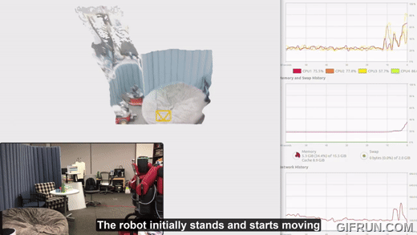
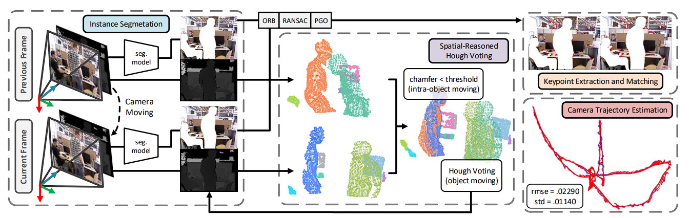
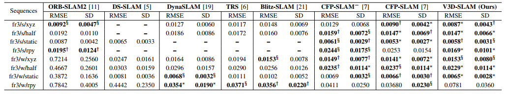
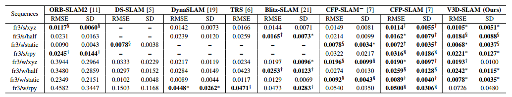

# V3D-SLAM: Robust RGB-D SLAM in Dynamic Environments with 3D Semantic Geometry Voting

## Authors

<ol>
    <li><a href="https://www.tuandang.info/">Tuan Dang</a></li>
    <li><a href="https://mkhangg.com/">Khang Nguyen</a></li>
    <li><a href="https://www.uta.edu/academics/faculty/profile?username=huber">Manfred Huber</a></li>
</ol>

>  All authors are with Learning and Adaptive Robotics Laboratory, Department of Computer Science and Engineering, University of Texas at Arlington, Arlington, TX 76013, USA.

## Abstract

Simultaneous localization and mapping (SLAM) in highly dynamic environments is challenging due to the correlation complexity between moving objects and the camera pose. Many methods have been proposed to deal with this problem; however, the moving properties of dynamic objects with a moving camera remain unclear. Therefore, to improve SLAM's performance, minimizing disruptive events of moving objects with a physical understanding of 3D shapes and dynamics of objects is needed. In this paper, we propose a robust method, **V3D-SLAM**, to remove moving objects via two lightweight re-evaluation stages, including identifying potentially moving and static objects using a spatial-reasoned Hough voting mechanism and refining static objects by detecting dynamic noise caused by intra-object motions using Chamfer distances as similarity measurements. Through our experiment on the TUM RGB-D benchmark on dynamic sequences with ground-truth camera trajectories, the results show that our methods outperform most other recent state-of-the-art SLAM methods. 

### Full demo is available at [YouTube](https://youtu.be/Q7d5BYLze9Y).

    
   <i>Baxter is mounted with Intel RealSense D435i RGB-D</i>

## Pipeline Overview

Overview of V3D-SLAM: improving the robustness of RGB-D SLAM in dynamic indoor environments, including instance segmentation coupled with RGB-based feature extraction, sensor noises and segmentation outlier rejection, and spatial-reasoned Hough voting mechanism for dynamic 3D objects, resulting in camera trajectory estimation.

     

## Evaluation on TUM RGB-D Dataset

- Results can be found at [results](https://github.com/tuantdang/v3d-slam/tree/main/results)
- We can verify results at ground-truth availble as an online tool at [Online Evaluation](https://cvg.cit.tum.de/data/datasets/rgbd-dataset/online_evaluation)

     
   <i>Comparisons of ATE between RGB-D SLAM techniques</i>
 

 
 

     
   <i>Comparisons of Translational Drift in RPE between RGB-D SLAM techniques</i>
 

  

     
   <i>Comparisons of Rotational Drift in RPE between RGB-D SLAM techniques</i>
 

## Citing
'''
@inproceedings{Dang2024V3D_SLAM,
  title        = {V3D‑SLAM: Robust RGB‑D SLAM in Dynamic Environments with 3D Semantic Geometry Voting},
  author       = {Tuan Dang and Khang Nguyen and Manfred Huber},
  booktitle    = {Proceedings of the IEEE/RSJ International Conference on Intelligent Robots and Systems (IROS)},
  year         = {2024},
  month        = oct,
  note         = {Presented 14--18 October 2024},
  url          = {https://arxiv.org/abs/2410.12068},
}
'''
